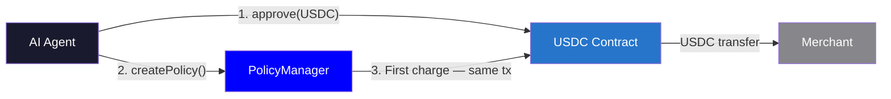
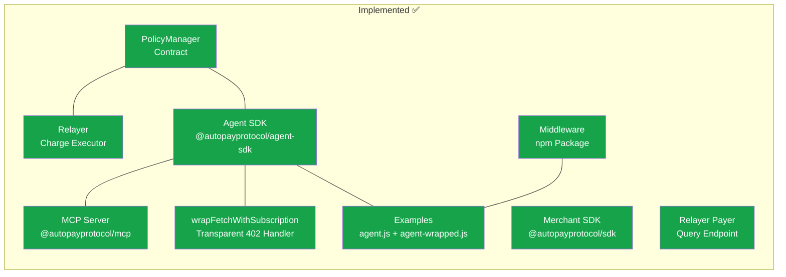
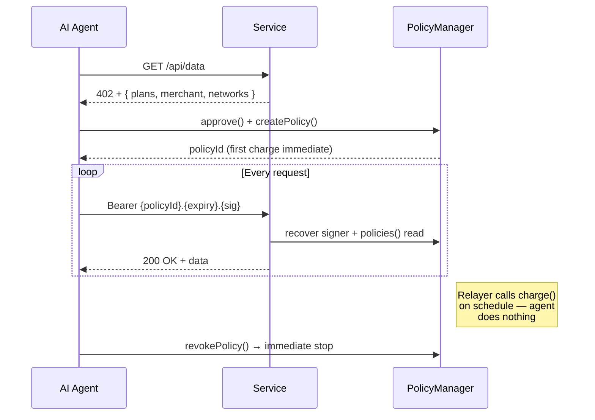
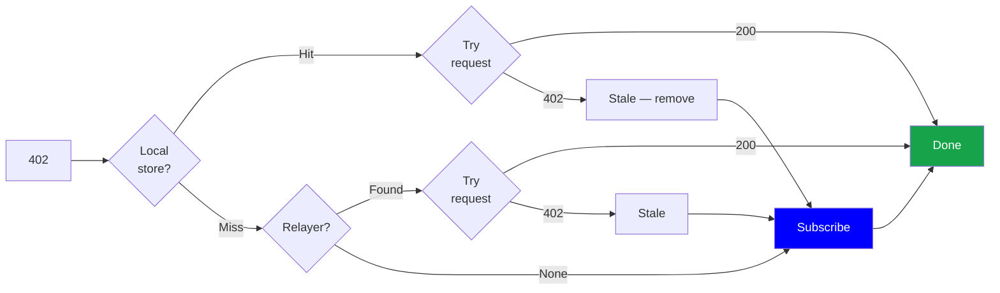
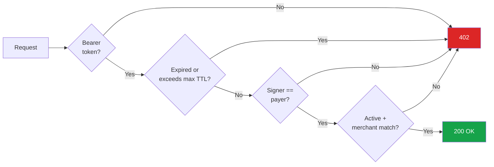
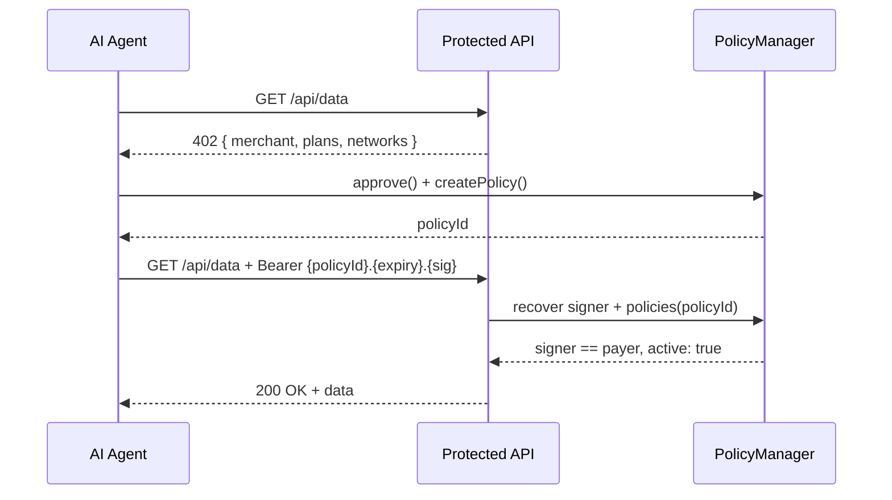
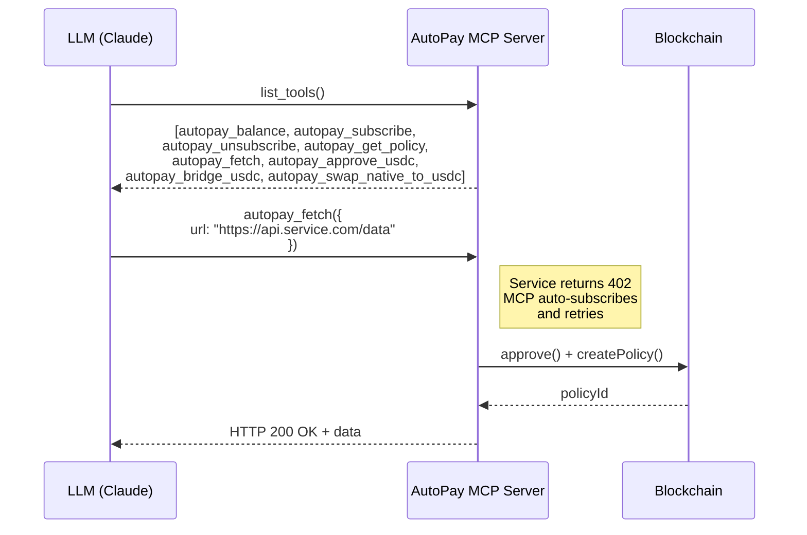
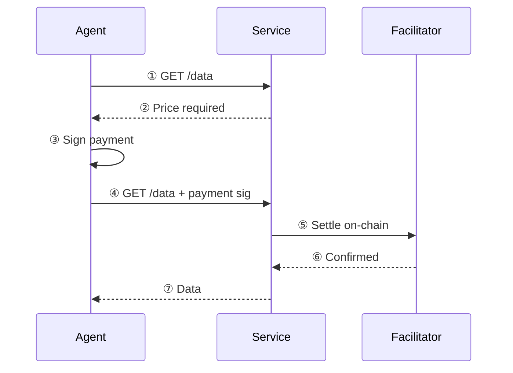
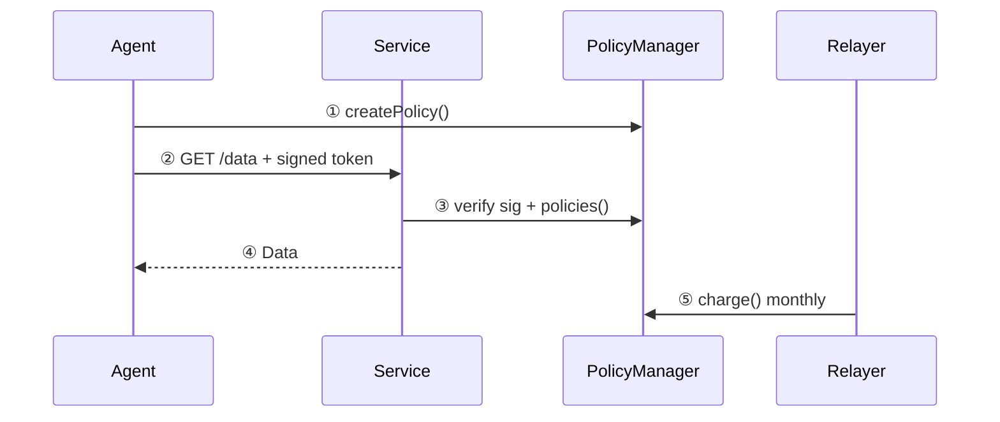
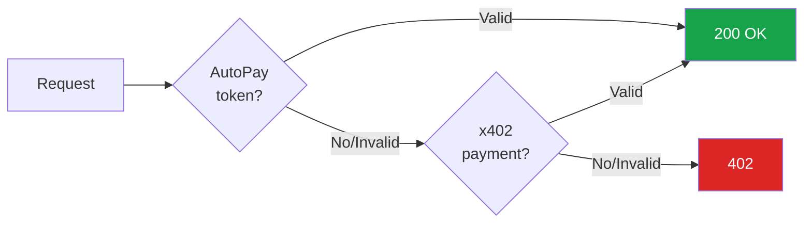

# AutoPay Agent Architecture

How AI agents discover, subscribe to, and use services through AutoPay.

> Per-request payment protocols require merchants to answer a fundamentally different question: *"what is a single API call worth?"* Most businesses haven't thought about that and don't want to. AutoPay lets merchants keep their existing subscription pricing — same tiers, same model — and accept payments from autonomous agents. It's a different payment rail, not a different business model.

---

## Table of Contents

1. [System Overview](#system-overview)
2. [Current Architecture](#current-architecture)
3. [Agent Subscription Lifecycle](#agent-subscription-lifecycle)
4. [Three Ways to Integrate](#three-ways-to-integrate)
5. [Service-Side Verification](#service-side-verification)
6. [How Agents Discover AutoPay](#how-agents-discover-autopay)
7. [AutoPay vs x402](#autopay-vs-x402)
8. [Using Both Together](#using-both-together)
9. [Implementation Status](#implementation-status)
10. [Remaining Friction Points](#remaining-friction-points)

---

## System Overview

AutoPay is a non-custodial recurring payment protocol. An AI agent subscribes once and gets ongoing access — the relayer handles renewals automatically. No payment logic in the agent's hot path.

#### Phase 1: Subscribe (once)



#### Phase 2: Use the Service (ongoing)


#### Phase 3: Auto-Renewal (agent does nothing)


### Key Properties

| Property | Detail |
|----------|--------|
| **Non-custodial** | USDC stays in agent wallet until the moment a charge executes |
| **On-chain enforcement** | Spending caps, intervals, and max retries are enforced by the contract |
| **Agent-initiated** | Agent creates and cancels subscriptions; relayer only executes scheduled charges |
| **No identity** | Wallet address is the only identifier. No KYC, no accounts, no API keys |
| **Multi-chain** | PolicyManager deployed on Flow EVM (747), Base (8453), and Base Sepolia (84532) |

---

## Current Architecture

What exists today, component by component.



### What's Live

| Component | What It Does | Location |
|-----------|--------------|----------|
| **PolicyManager** | On-chain policy CRUD, spending caps, auto-cancel | `contracts/src/ArcPolicyManager.sol` |
| **Relayer** | Event indexing, scheduled charges, webhooks | `relayer/src/` |
| **Agent SDK** | `AutoPayAgent` class: subscribe, revoke, sign tokens, bridge USDC, balance checks | `packages/agent-sdk/` |
| **Fetch wrapper** | Intercepts 402s, subscribes, retries, recovers existing policies, auto-bridges | `packages/agent-sdk/src/fetch.ts` |
| **MCP server** | 8 tools for Claude and MCP-compatible agents | `packages/mcp/` |
| **Middleware** | Express guard: Bearer token verification, 402 discovery responses | `packages/middleware/` |
| **Merchant SDK** | Checkout URLs, webhook verification, fee math | `packages/sdk/` |
| **Payer endpoint** | `GET /payers/:address/policies` for subscription lookups | `relayer/src/api/index.ts` |
| **Examples** | Manual, zero-boilerplate, and bridge agent flows + test service | `examples/agent-subscription/` |

---

## Agent Subscription Lifecycle

The full flow from first contact to cancellation.



### On-Chain Operations (Agent Pays Gas)

| Operation | Contract Call | Gas Cost | When |
|-----------|-------------|----------|------|
| Approve USDC | `USDC.approve(PolicyManager, amount)` | ~45,000 gas | Auto-handled by `subscribe()` if needed |
| Subscribe | `PM.createPolicy(...)` | ~120,000 gas | Once per subscription |
| Cancel | `PM.revokePolicy(policyId)` | ~40,000 gas | Once per subscription |
| Check status | `PM.policies(policyId)` | 0 (view call) | Every verification |

Gas costs on Base: ~5-20 cents per write. On Flow EVM: <1 cent per write.

### Off-Chain Operations (Free)

| Operation | Method | When |
|-----------|--------|------|
| Discover subscription options | `GET /api/... → 402` | On first contact |
| Use service | `GET /api/... + Bearer token` | Every request |
| Verify subscription (service-side) | `readContract policies()` | Every request (cached) |

---

## Three Ways to Integrate

### 1. MCP Server (AI Agents via Claude / LLM)

For AI agents using the Model Context Protocol — zero code required from the agent developer:

```json
{
  "mcpServers": {
    "autopay": {
      "command": "npx",
      "args": ["@autopayprotocol/mcp"],
      "env": {
        "AUTOPAY_PRIVATE_KEY": "0xYOUR_KEY",
        "AUTOPAY_CHAIN": "base"
      }
    }
  }
}
```

The MCP server exposes 8 tools:

| Tool | Description |
|------|-------------|
| `autopay_balance` | Check USDC + gas balance |
| `autopay_subscribe` | Create subscription (auto-approves USDC) |
| `autopay_unsubscribe` | Cancel subscription |
| `autopay_get_policy` | Read policy details |
| `autopay_fetch` | Fetch URL with transparent 402 handling |
| `autopay_approve_usdc` | Explicit USDC pre-approval |
| `autopay_bridge_usdc` | Bridge USDC from another chain via LiFi |
| `autopay_swap_native_to_usdc` | Swap native tokens to USDC on the same chain via LiFi |

### 2. `wrapFetchWithSubscription` (Zero-Boilerplate)

For programmatic agents that use `fetch` — wrap it once, 402 handling is automatic:

```typescript
import { AutoPayAgent, wrapFetchWithSubscription, FileStore } from '@autopayprotocol/agent-sdk'

const agent = new AutoPayAgent({
  privateKey: process.env.KEY as `0x${string}`,
  chain: 'base',
})

// FileStore persists subscriptions to disk — survives restarts
const fetchWithPay = wrapFetchWithSubscription(fetch, agent, {
  store: new FileStore('.autopay/subscriptions.json'),
})

// Just fetch — 402 → subscribe → retry is transparent
const res = await fetchWithPay('https://api.service.com/data')
```

#### Subscription Recovery Flow

When the wrapper encounters a 402, it tries to recover an existing subscription before creating a new one:



| Step | Source | Trust | Cost |
|------|--------|-------|------|
| 1. Local store | Agent's own disk | Trusted (agent controls it) | Free |
| 2. Relayer query | `relayerUrl` from 402 body | Verified — policyId is tested against the service before use | Free (one HTTP call) |
| 3. Subscribe fresh | On-chain | Source of truth | Gas + first charge |

> **Note:** The wrapper subscribes on the agent's configured chain. It does not read the `networks` array from the 402 body. Ensure the agent's chain matches what the service supports.

### 3. Direct SDK (Full Control)

For agents that need explicit control over every step — discover plans via 402, then subscribe:

```typescript
import { AutoPayAgent } from '@autopayprotocol/agent-sdk'

const agent = new AutoPayAgent({
  privateKey: process.env.KEY as `0x${string}`,
  chain: 'base',
})

// Step 1: Hit the service — get 402 with plan details
const discovery = await fetch('https://api.service.com/data')
if (discovery.status === 402) {
  const body = await discovery.json()
  const plan = body.autopay.plans[0] // Merchant-defined plan

  // Step 2: Subscribe using the plan details from the 402 response
  const sub = await agent.subscribe({
    merchant: body.autopay.merchant,
    amount: Number(plan.amount),
    interval: plan.interval,
    spendingCap: Number(plan.amount) * 30,
    metadataUrl: plan.metadataUrl,
  })

  // Step 3: Create a signed Bearer token and use the service
  const token = await agent.createBearerToken(sub.policyId)
  const res = await fetch('https://api.service.com/data', {
    headers: { Authorization: `Bearer ${token}` },
  })

  // Step 4: Cancel when done
  await agent.unsubscribe(sub.policyId)
}
```

---

## Service-Side Verification

How a service confirms an agent has a valid, signed subscription token.

Bearer tokens use the format `{policyId}.{expiry}.{signature}` where the signature is an EIP-191 signature of `{policyId}:{expiry}`, proving the agent owns the wallet that created the subscription.



> On-chain reads are cached (TTL: 60s). The signature recovery and expiry check happen locally (no RPC calls).

### Policy Struct Reference

The `policies(bytes32)` getter returns a 12-field tuple. Services read index 10 (`active`) for gating:

```
Index  Field                  Type       Used For
──────────────────────────────────────────────────
0      payer                  address    Who's being charged
1      merchant               address    Who receives payment
2      chargeAmount           uint128    USDC per charge (6 decimals)
3      spendingCap            uint128    Max total spend (0 = unlimited)
4      totalSpent             uint128    Running total
5      interval               uint32     Seconds between charges
6      lastCharged            uint32     Timestamp of last charge
7      chargeCount            uint32     Successful charge count
8      consecutiveFailures    uint8      Soft-fail streak
9      endTime                uint32     0 = still active
10     active                 bool       ← SERVICE CHECKS THIS
11     metadataUrl            string     Off-chain metadata
```

### Signed Bearer Tokens

Agents create signed tokens that prove wallet ownership:

```
Format: {policyId}.{expiry}.{signature}
  - policyId:  bytes32 hex (the on-chain subscription ID)
  - expiry:    unix timestamp (token validity, default: 1 hour)
  - signature: EIP-191 signature of "{policyId}:{expiry}"
```

**Why not just use policyId?** Policy IDs are public on-chain — anyone could read them from events and impersonate a subscriber. The signed token proves the requester owns the wallet that created the policy.

Agent side:
```typescript
const token = await agent.createBearerToken(policyId) // signs with agent's wallet
```

> `wrapFetchWithSubscription` caches signed tokens and reuses them until 5 minutes before expiry — no re-signing on every request.

Service side (using `@autopayprotocol/middleware`):
```typescript
import { requireSubscription } from '@autopayprotocol/middleware'

const auth = requireSubscription({
  merchant: MERCHANT_ADDRESS,
  chain: 'base',
  plans,
  maxTokenAgeSeconds: 86_400,  // reject tokens valid for longer than 24h (default)
  clockSkewSeconds: 30,        // tolerate 30s clock drift (default)
})
app.get('/api/data', auth, handler)
```

**Verification flow:** token format → expiry (with clock skew tolerance) → max lifetime check → recover signer from signature → read on-chain policy (cached 60s) → check `active`, `merchant` match, and `signer == payer`.

| Security control | Default | Purpose |
|-----------------|---------|---------|
| `maxTokenAgeSeconds` | 86,400 (24h) | Prevents agents from creating tokens valid for years — limits damage if a token leaks |
| `clockSkewSeconds` | 30 | Tolerates minor clock differences between agent and service |
| `cacheTtlMs` | 60,000 (60s) | On-chain policy cache — balances freshness vs RPC costs |

---

## How Agents Discover AutoPay

### HTTP 402 Discovery

When an agent hits a protected endpoint, the service responds with subscription options:



> `wrapFetchWithSubscription` handles steps 2-4 automatically — the agent just calls `fetch()`.

### 402 Response Schema

```json
{
  "error": "Subscription required",
  "accepts": ["autopay"],
  "autopay": {
    "type": "subscription",
    "merchant": "0xServiceAddress",
    "plans": [
      {
        "name": "Basic",
        "amount": "10",
        "currency": "USDC",
        "interval": 2592000,
        "metadataUrl": "https://api.service.com/plans/basic.json"
      }
    ],
    "networks": [
      {
        "chainId": 8453,
        "name": "Base",
        "policyManager": "0x037A24595E96B10d9FB2c7c2668FE5e7F354c86a",
        "usdc": "0x833589fCD6eDb6E08f4c7C32D4f71b54bdA02913"
      },
      {
        "chainId": 747,
        "name": "Flow EVM",
        "policyManager": "0x5EDAF928C94A249C5Ce1eaBaD0fE799CD294f345",
        "usdc": "0xF1815bd50389c46847f0Bda824eC8da914045D14"
      }
    ],
    "relayerUrl": "https://relayer.autopayprotocol.com"
  }
}
```

| Field&nbsp;&nbsp;&nbsp;&nbsp;&nbsp;&nbsp;&nbsp;&nbsp;&nbsp;&nbsp;&nbsp;&nbsp;&nbsp;&nbsp; | Required | Description |
|----------------------|----------|-------------|
| merchant | Yes | Merchant's on-chain address |
| plans | Yes | Available subscription plans (name, amount, interval) |
| networks | Yes | Supported chains with contract addresses |
| relayerUrl | No | Relayer API base URL for querying existing subscriptions. Self-hosted relayers should set this to their own URL. |

### MCP Tool Discovery

AI agents using the Model Context Protocol discover AutoPay as a set of tools:



---

## AutoPay vs x402

### Architectural Difference

**x402: Pay-Per-Request** — every request settles on-chain via a facilitator.



**AutoPay: Subscribe Once** — one on-chain tx, then free reads. Relayer charges on schedule.



### Comparison Table

| Dimension | x402 | AutoPay |
|-----------|------|---------|
| **Payment model** | Per-request micropayment | Recurring subscription |
| **Who initiates payment** | Client (signs every request) | Relayer (charges on schedule) |
| **On-chain txs per access** | 1 per request | 1 per billing period |
| **Agent complexity** | Payment logic in every request | Subscribe once, use freely |
| **Cost at high frequency** | Gas * N requests | Gas * 1 subscription |
| **State** | Stateless (each payment is atomic) | Stateful (policy tracks billing) |
| **Spending controls** | None built-in (agent self-enforces) | On-chain: cap, interval, max retries |
| **Merchant can pull funds** | No (client always pays) | Yes (relayer calls charge()) |
| **Cancellation** | Stop paying | `revokePolicy()` — immediate |
| **SDK** | `@x402/fetch`, `@x402/express` | `@autopayprotocol/agent-sdk`, `@autopayprotocol/mcp` |
| **Transparent fetch wrapper** | `wrapFetchWithPayment` | `wrapFetchWithSubscription` |
| **MCP server** | Via x402 MCP tools | `@autopayprotocol/mcp` (8 tools) |
| **Supported chains** | Base, Ethereum, Optimism, Polygon, Arbitrum, Avalanche, Solana | Flow EVM, Base, Base Sepolia |
| **Best for** | One-off lookups, unpredictable usage, micropayments | Ongoing access, predictable costs, high-frequency use |

### Cost Comparison

Both protocols are valid — the right choice depends on the merchant's pricing model and how their customers use the service.

**Fee structure (as of early 2026, Base L2):**

| | x402 | AutoPay |
|--|------|---------|
| Settlement | Per-request on-chain | Once per billing cycle |
| Gas per API call | ~$0.001 (on-chain settlement) | $0 (signed Bearer token, off-chain) |
| Setup gas | $0 | ~$0.05 (approve + createPolicy) |
| Protocol fee | Free first 1,000 tx/month, then $0.001/tx (Coinbase facilitator) | 2.5% on each charge |

**Example: $10/month data service on Base**

| Requests/month | x402 cost | AutoPay cost |
|---------------|-----------|-------------|
| 10 | $0.11 | $10.25 |
| 100 | $1.10 | $10.25 |
| 1,000 | $11.00 | $10.25 |
| 10,000 | $110.00 | $10.25 |

**When each model fits:**

| x402 is a better fit | AutoPay is a better fit |
|---------------------|------------------------|
| Pay-per-use pricing (metered APIs) | Flat-rate or tiered subscriptions |
| Infrequent or unpredictable usage | High-frequency, ongoing access |
| One-off purchases or single queries | Recurring services (SaaS, data feeds) |
| No commitment — agents pay as they go | Predictable revenue for merchants |
| Simple integration (no relayer needed) | Lower per-request cost at scale |

Merchants can support both — see [Using Both Together](#using-both-together) below.

> **Why AutoPay exists:** Most services already have a subscription model — $10/month, $99/year, usage tiers. AutoPay lets merchants bring that exact pricing to crypto without rethinking their business model. No per-request pricing decisions, no metering infrastructure, no facilitator integration. Just replace Stripe with AutoPay and the same subscription tiers work for AI agents. Per-request settlement adds gas to every API call ($110 in gas at 10,000 requests/month on Base) — AutoPay moves settlement off the hot path: one on-chain charge per billing cycle, every request in between is a free signed token.

---

## Using Both Together

A service can accept both x402 (one-off) and AutoPay (subscription) payments:



```typescript
// Dual-protocol service middleware
async function handleRequest(req, res) {
  // Check AutoPay signed token first (cheaper for frequent users)
  const token = req.headers.authorization?.replace('Bearer ', '')
  if (token && await verifySubscription(token)) {
    return serveRequest(req, res)
  }

  // Fall back to x402 per-request payment
  const payment = req.headers['x-payment']
  if (payment && await verifyX402Payment(payment)) {
    return serveRequest(req, res)
  }

  // No payment — return 402 with both options
  res.status(402).json({
    accepts: ['x402', 'autopay'],
    x402: { price: '$0.01', network: 'base', token: 'USDC' },
    autopay: { merchant: '0x...', plans: [...], networks: [...] },
  })
}
```

---

## Implementation Status

### Detailed Status Matrix

| Layer | Component | Status | Code Location |
|-------|-----------|--------|---------------|
| **Contract** | PolicyManager | Deployed | `contracts/src/ArcPolicyManager.sol` |
| **Contract** | All agent functions (create, revoke, read) | Working | Same |
| **Contract** | Spending caps, intervals, auto-cancel | Working | Same |
| **Relayer** | Event indexing | Running | `relayer/src/indexer/` |
| **Relayer** | Charge execution | Running | `relayer/src/executor/` |
| **Relayer** | Webhooks | Running | `relayer/src/webhooks/` |
| **Relayer** | `GET /payers/:address/policies` | Built | `relayer/src/api/index.ts` |
| **SDK** | Merchant SDK (`@autopayprotocol/sdk`) | Published | `packages/sdk/` |
| **SDK** | Agent SDK (`@autopayprotocol/agent-sdk`) | Built | `packages/agent-sdk/` |
| **SDK** | `wrapFetchWithSubscription` | Built | `packages/agent-sdk/src/fetch.ts` |
| **SDK** | Cross-chain bridge (`bridgeUsdc`) | Built | `packages/agent-sdk/src/bridge.ts` |
| **SDK** | `AutoPayAgent` class | Built | `packages/agent-sdk/src/agent.ts` |
| **SDK** | Typed errors | Built | `packages/agent-sdk/src/errors.ts` |
| **MCP** | MCP server (`@autopayprotocol/mcp`) | Built | `packages/mcp/` |
| **MCP** | 8 tools (balance, subscribe, unsubscribe, get_policy, fetch, approve, bridge_usdc, swap_native_to_usdc) | Built | `packages/mcp/src/index.ts` |
| **Middleware** | `@autopayprotocol/middleware` | Built | `packages/middleware/` |
| **Middleware** | Express `requireSubscription` | Built | `packages/middleware/src/express.ts` |
| **Example** | Manual agent flow | Working | `examples/agent-subscription/agent.js` |
| **Example** | Zero-boilerplate agent flow | Working | `examples/agent-subscription/agent-wrapped.js` |

### Package Details

| Package | Version | Build | Peer Deps |
|---------|---------|-------|-----------|
| `@autopayprotocol/agent-sdk` | 0.1.0 | ESM + CJS via tsup | `viem ^2.0.0` |
| `@autopayprotocol/mcp` | 0.1.0 | ESM + CJS via tsup (with shebang) | `@autopayprotocol/agent-sdk`, `viem`, `zod` |
| `@autopayprotocol/middleware` | 0.1.0 | ESM + CJS via tsup | `viem ^2.0.0` |
| `@autopayprotocol/sdk` | Published | ESM + CJS via tsup | None |

---

## Contract Addresses

| Chain | Chain ID | PolicyManager | USDC |
|-------|----------|---------------|------|
| Flow EVM | 747 | `0x5EDAF928C94A249C5Ce1eaBaD0fE799CD294f345` | `0xF1815bd50389c46847f0Bda824eC8da914045D14` |
| Base | 8453 | `0x037A24595E96B10d9FB2c7c2668FE5e7F354c86a` | `0x833589fCD6eDb6E08f4c7C32D4f71b54bdA02913` |
| Base Sepolia | 84532 | `0x5EDAF928C94A249C5Ce1eaBaD0fE799CD294f345` | `0x036CbD53842c5426634e7929541eC2318f3dCF7e` |

## Key Constants

| Constant | Value | Note |
|----------|-------|------|
| `PROTOCOL_FEE_BPS` | 250 | 2.5% fee on every charge |
| `MIN_INTERVAL` | 60 seconds | 1 minute minimum billing cycle |
| `MAX_INTERVAL` | 31,536,000 seconds | 365 days |
| `MAX_RETRIES` | 3 | Consecutive failures before auto-cancel |

## Interval Presets

| Preset | Seconds |
|--------|---------|
| `hourly` | 3,600 |
| `daily` | 86,400 |
| `weekly` | 604,800 |
| `biweekly` | 1,209,600 |
| `monthly` | 2,592,000 |
| `quarterly` | 7,776,000 |
| `yearly` | 31,536,000 |

---

*Last updated: March 2026*
