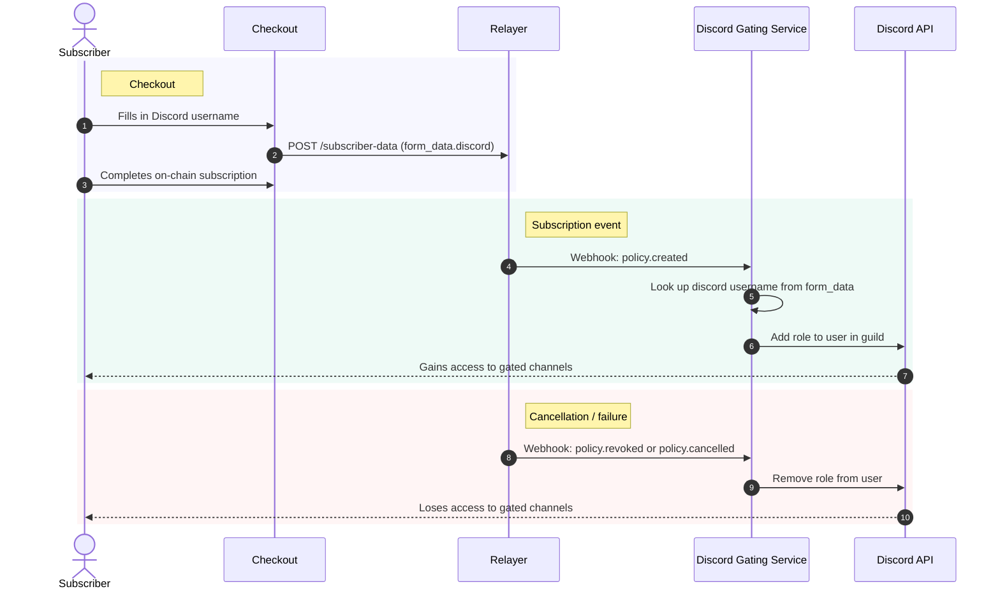

# Discord Subscription Gating

## Overview

Discord subscription gating controls access to a Discord server (or specific channels/roles) based on whether a user has an active AutoPay subscription. When a subscriber pays, they get a role. When they cancel or their payment fails, the role is removed and access is revoked.

This document captures architectural decisions, integration boundaries, and the implementation plan for adding Discord gating to AutoPay.

---

## Decision: Self-Hosted Custom Bot (Option B)

We build a Discord bot that integrates directly with AutoPay's existing subscription events. No third-party managed services.

### Why Not Alternatives?

| Option | Why Not |
|--------|---------|
| **Discord native Server Subscriptions** | US-only, 10% fee, no crypto, limited to 3 tiers, can't hide gated channels |
| **Managed services** (Whop, LaunchPass, Subscord) | 3-10% ongoing fees, no on-chain recurring auto-pay support, vendor lock-in, limited data ownership |
| **Discord Linked Roles** | User-initiated (passive), can't proactively revoke access on payment failure |

### Why Self-Hosted?

- **Zero platform fees** — AutoPay already processes payments on-chain (2.5% protocol fee only)
- **Full control** — over UX, data, role lifecycle, and dispute handling
- **Unique value** — on-chain auto-pay gated Discord doesn't exist anywhere else
- **Infrastructure already exists** — relayer already tracks subscriptions, fires webhooks, and stores form data

---

## Architecture: Separation of Concerns

### Core AutoPay Product (Checkout + Relayer)

The core AutoPay checkout and relayer are **not** responsible for managing Discord bots or roles. Their job is limited to:

1. **Collecting the subscriber's Discord username** during checkout (already supported — `discord` is a valid `SubscriberFieldKey`)
2. **Storing it in the relayer database** as part of `form_data` in the `subscriber_data` table (already works)
3. **Firing webhook events** on subscription lifecycle changes (`PolicyCreated`, `ChargeSucceeded`, `ChargeFailed`, `PolicyRevoked`, `PolicyCancelledByFailure`)

That's it. AutoPay stays a payment protocol. Discord integration is a consumer of AutoPay events, not part of the core product.

### Discord Gating Service (Separate Repo)

A standalone open-source service in its own repository (`autopay-discord-gating` or similar) that integrates with AutoPay to manage Discord roles.

- **Separate repo, separate deployment** — independent release cycle from core AutoPay
- **Open source** — operators need to trust what has `MANAGE_ROLES` on their server; consistent with AutoPay's open-source positioning
- **Self-contained** — anyone can fork, deploy, and customize without touching the AutoPay monorepo
- **Extensible pattern** — establishes the template for future gating integrations (Telegram, Slack, etc.) as their own repos

```
┌─────────────────────────────────────────────────────┐
│                   AutoPay Core                       │
│                                                      │
│  Checkout ──→ Relayer DB (subscriber_data.form_data) │
│                    │                                 │
│                    ├─ Webhook: policy.created         │
│                    ├─ Webhook: charge.succeeded       │
│                    ├─ Webhook: charge.failed          │
│                    ├─ Webhook: policy.revoked         │
│                    └─ Webhook: policy.cancelled       │
└────────────────────┬────────────────────────────────┘
                     │ HTTPS webhooks
                     ▼
┌─────────────────────────────────────────────────────┐
│            Discord Gating Service                    │
│                                                      │
│  Webhook receiver ──→ Role manager ──→ Discord API   │
│                                                      │
│  Config provided by merchant/relayer operator:       │
│    - Discord bot token                               │
│    - Guild ID                                        │
│    - Role ID(s) per plan                             │
│    - Webhook secret (for signature verification)     │
└─────────────────────────────────────────────────────┘
```

### Why Separate?

1. **Not every merchant needs Discord** — keep core AutoPay lean
2. **Different deployment lifecycle** — Discord bot updates shouldn't require relayer redeployments
3. **Self-hosted relayers opt in** — they provide their own bot token, guild ID, and role mappings
4. **Can evolve independently** — add Telegram gating, Slack gating, etc. without touching core

---

## Relayer Operator Opt-In

Self-hosted relayer operators who want Discord gating provide:

| Setting | Description | Example |
|---------|-------------|---------|
| `DISCORD_BOT_TOKEN` | Bot token from Discord Developer Portal | `MTIz...` |
| `DISCORD_GUILD_ID` | The server to manage roles in | `123456789012345678` |
| `DISCORD_ROLE_MAP` | Plan ID → Discord role ID mapping | `{"plan_abc": "987654321"}` |
| `AUTOPAY_WEBHOOK_SECRET` | Shared secret for verifying webhook signatures | `whsec_...` |

Operators who don't set these variables simply don't get Discord gating. No impact on core relayer functionality.

---

## Data Flow

### Subscriber Checkout → Discord Role Assignment



### Webhook Events the Discord Service Consumes

| AutoPay Event | Discord Action |
|---------------|----------------|
| `policy.created` | Assign subscriber role |
| `charge.succeeded` | No-op (role already assigned) — optionally log |
| `charge.failed` | Optionally notify subscriber via DM; keep role during retry window |
| `policy.revoked` (subscriber cancelled) | Remove subscriber role |
| `policy.cancelled` (3 consecutive failures) | Remove subscriber role |

---

## Discord Bot Requirements

### Permissions

| Permission | Why |
|------------|-----|
| `MANAGE_ROLES` | Add/remove subscriber roles |
| `GUILD_MEMBERS` intent | Fetch members by ID, track join/leave |

### Role Hierarchy

The bot's highest role **must** be positioned above any subscriber role it manages in the server's role hierarchy. Otherwise Discord API will reject role assignment.

### Identifying Subscribers

The checkout currently collects a Discord **username** (text field). To map this to a Discord user ID for role management, the service needs one of:

| Approach | Pros | Cons |
|----------|------|------|
| **Discord OAuth2 at checkout** | Get exact user ID, can auto-join server via `guilds.join` scope | Requires OAuth2 flow in checkout, more complex UX |
| **Username lookup via bot** | Simple text input at checkout (already exists) | Usernames aren't unique identifiers; requires user to be in server already |
| **Slash command `/verify`** | User self-links in Discord after subscribing | Extra step for subscriber; no immediate gating |

**Recommended (easiest and most native):** Start with **username collection** (already in place) combined with a **`/verify` slash command** in the Discord server. The subscriber enters their Discord username at checkout, then runs `/verify <wallet-address>` in Discord. The bot cross-references the wallet address against the relayer DB to confirm the subscription and assign the role.

This avoids OAuth2 complexity while still being secure — the verification happens inside Discord where the user is already authenticated.

**Future enhancement:** Add Discord OAuth2 to checkout for seamless one-click linking + auto-join. This is a better UX but more engineering effort.

---

## Dispute Handling

Disputes on AutoPay are fundamentally different from traditional payment disputes (chargebacks). All payments are on-chain and verifiable.

### On-Chain Proof

Every charge is a blockchain transaction with:
- Transaction hash
- Block number and timestamp
- Payer address, merchant address, amount
- Policy ID linking to the original subscription terms

This is **irrefutable proof** that a payment was made (or not made). There is no "he said, she said."

### Merchant Manual Intervention

For edge cases where automated role management isn't sufficient, the merchant retains full manual control over their Discord server:

| Scenario | Resolution |
|----------|------------|
| **Subscriber claims they paid but lost role** | Merchant checks on-chain — if payment exists, re-assign role manually |
| **Role wasn't removed after cancellation** | Merchant removes role manually; investigate webhook delivery failure |
| **Subscriber wants a refund** | Not an AutoPay concern — merchant handles refund policy off-chain; can remove role manually |
| **Webhook delivery failure** | Discord gating service should implement periodic reconciliation (see below) |

### Reconciliation (Safety Net)

The Discord gating service should run a periodic reconciliation job (e.g., every 6 hours) that:

1. Queries the relayer API for all active subscriptions for the merchant
2. Cross-references against current Discord role holders
3. Adds roles for any active subscribers missing them
4. Removes roles for any lapsed subscribers still holding them

This catches any missed webhooks, API failures, or race conditions. Every production Discord gating system uses this pattern.

---

## Multi-Plan → Multi-Role Mapping

A merchant may have multiple subscription plans, each gating different channels:

```json
{
  "plan_basic": "1234567890",
  "plan_pro": "1234567891",
  "plan_vip": "1234567892"
}
```

The Discord gating service maps each AutoPay plan ID to a specific Discord role ID. When a subscriber's plan is identified from the webhook payload, the corresponding role is assigned.

---

## Implementation Phases

### Phase 1: Minimal Viable Integration

**Scope:** Get Discord gating working end-to-end with the simplest possible approach.

- [ ] Discord bot that receives AutoPay webhooks and manages roles
- [ ] `/verify` slash command for subscriber self-linking
- [ ] Role assignment on `policy.created`, removal on `policy.revoked` / `policy.cancelled`
- [ ] Config via environment variables (bot token, guild ID, role map, webhook secret)
- [ ] Webhook signature verification
- [ ] Basic logging

**What already exists in AutoPay core (no changes needed):**
- `discord` field in checkout (`SubscriberFieldKey`)
- `form_data` JSONB storage in `subscriber_data` table
- Webhook delivery on subscription lifecycle events

### Phase 2: Resilience

- [ ] Periodic reconciliation cron (cross-reference relayer API against Discord roles)
- [ ] Retry queue for failed Discord API calls
- [ ] Health check endpoint
- [ ] Structured logging with subscription context

### Phase 3: Enhanced UX

- [ ] Discord OAuth2 in checkout (capture user ID directly, enable `guilds.join` auto-join)
- [ ] Subscriber DMs on payment failure / upcoming charge
- [ ] `/status` slash command (check subscription status from Discord)
- [ ] Multi-plan → multi-role mapping
- [ ] Merchant dashboard showing Discord-linked subscribers

---

## Tech Stack

| Component | Choice | Rationale |
|-----------|--------|-----------|
| **Runtime** | Node.js | Matches relayer stack; Stripe SDK and discord.js both Node-native |
| **Discord library** | discord.js (v14+) | Most mature, best documented, largest ecosystem |
| **Web server** | Express or Fastify | Webhook receiver endpoint |
| **Database** | PostgreSQL (shared or separate) | Store user-link mappings (wallet ↔ Discord ID) |
| **Hosting** | Railway / Fly.io / VPS | Same options as relayer |

---

## Security Considerations

| Concern | Mitigation |
|---------|------------|
| Webhook spoofing | Verify AutoPay webhook signatures on every request |
| Bot token exposure | Store as env var, never commit to repo |
| Role escalation | Bot role should only be above subscriber roles, not admin roles |
| Rate limiting | Discord API has rate limits (50 role changes/s per guild) — queue operations |
| Stale access | Reconciliation cron catches any missed revocations |

---

## Related Documentation

- **Relayer Configuration** — Environment variables for the AutoPay relayer
- **SDK Integration Guide** — Webhook events and signature verification
- **Merchant Guide** — Setting up plans and checkout
- **Merchant Checkout Example** — End-to-end checkout integration
